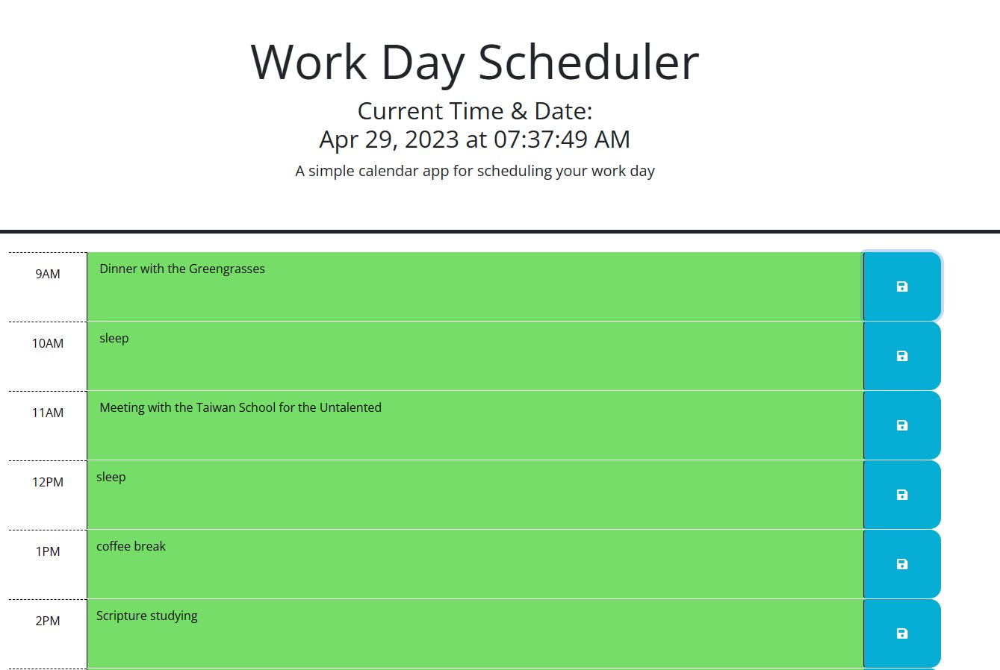

# Work Day Scheduler

## Description

A simple work day scheduler made using the basics of HTML, JavaScript, and CSS with massive help from Day.js and jQuery which does the heavy lifting of making the code run. 

## Website Link

[Website deployed link](https://roamingheart.github.io/work-day-sched/)

## Website Preview

## Criteria of Acceptance
* GIVEN I am using a daily planner to create a schedule
* WHEN I open the planner
* THEN the current day is displayed at the top of the calendar
* WHEN I scroll down
* THEN I am presented with timeblocks for standard business hours
* WHEN I view the timeblocks for that day
* THEN each timeblock is color coded to indicate whether it is in the past, present, or future
* WHEN I click into a timeblock
* THEN I can enter an event
* WHEN I click the save button for that timeblock
* THEN the text for that event is saved in local storage
* WHEN I refresh the page
* THEN the saved events persist

## Credits
I obtained the starter code from the MSU Fullstack Bootcamp. I gained the knowledge to use .toggleClass, .removeClass and .addClass from [Thomas Calle](https://github.com/ThomasCalle) to allow for me to add and remove class names onto the different div tags.

Calle, Thomas - Overview. (n.d.). GitHub. https://github.com/ThomasCalle
## Liscense 
 [Open Source Initiative Link](https://opensource.org/licenses/MIT)